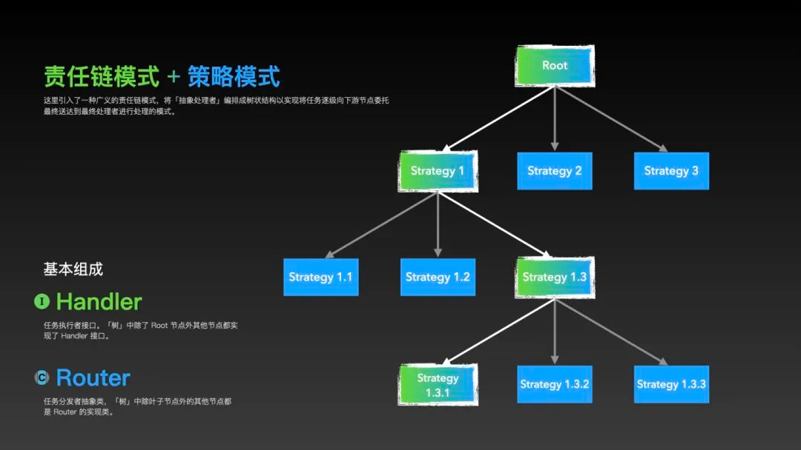
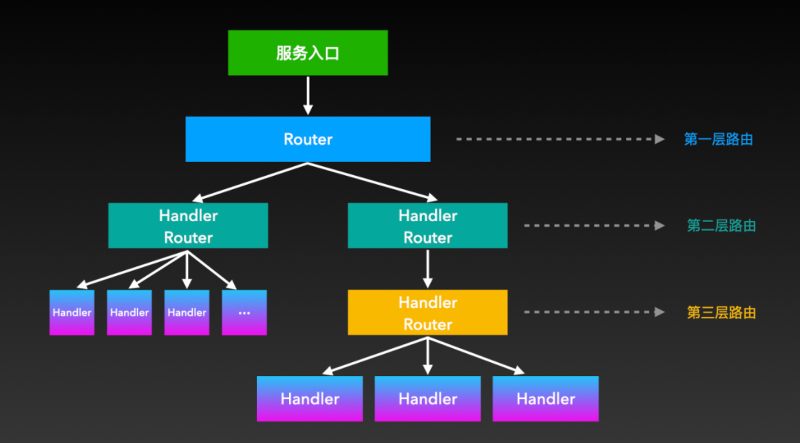

# strategy-router-examples

+ 如何优化你的if-else？来试试“责任树模式”（责任链+策略模式）: <https://mp.weixin.qq.com/s/Wib0Ly45te00HMUnIG-tbg>

> 将责任链与策略模式融合，即成为了一种广义的责任链模式，我简称为“责任树模式”。  
> 这种模式不仅可以完成任务的逐级委托，也可以在任一级选择不同的下游策略进行处理。

> 1. Router 是一个抽象类，负责定义如何路由到下游的多个子节点。
> 2. Handler 是接口，负责实现每个节点的业务逻辑。
>
> 从图中我们可以看出以下几个要点：
> 1. 除了根节点（入口）外，每个节点都实现了 Handler 接口。根节点只继承 Router 抽象类。
> 2. 所有叶子节点只实现 Handler 接口而无需继承 Router 抽象类（无需再向下委托）。
> 3. 除了根节点和叶子节点外的其他节点，都是上一层的 Handler，同时是下一层的 Router。

## 场景
1. 请假审批流程

